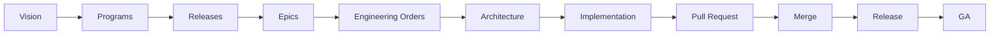

# STRATECH V2 — Governance Model

Formaliza como decisões são tomadas, especificadas, revisadas, implementadas e encerradas na STRATECH V2. Este documento é a **fonte primária** do modelo de papéis e do fluxo de estágios — `docs/product/STRATECH_V2_MASTER_ROADMAP.md` (Seção 2, Product Lifecycle) apresenta a mesma informação em formato de painel executivo, derivada deste documento, não o contrário.

> **Nota de institucionalização (EO-018):** este documento formaliza o modelo de 3 papéis já registrado em LL-002 (`LESSONS_LEARNED.md`) e o fluxo de estágios já descrito na Seção 2 do Master Roadmap. Por instrução explícita da EO-018, o Master Roadmap não foi alterado nesta consolidação — como consequência, sua Seção 2 e este documento descrevem o mesmo fluxo em paralelo até que uma EO futura autorize atualizar o Master Roadmap para apontar para este arquivo como fonte primária. Ver "Lacunas" na entrega da EO-018.

---

## 1. Modelo de papéis

Três papéis distintos e independentes, conforme LL-002:

| Papel | Responsabilidade | O que nunca faz sozinho |
|---|---|---|
| **Founder** | Decisões estratégicas, autorização de merge, configuração administrativa do GitHub (rulesets, branch protection) | Não implementa código nem revisa arquitetura de forma independente |
| **Claude / Engineering Lead** | Implementação, testes com evidência real (não apenas leitura de código), execução de CI, parar explicitamente quando um gate não pode ser comprovado | Nunca realiza merge sem autorização explícita (EO-MERGE); nunca comita commits parciais |
| **ChatGPT / Architecture & Product Advisor** | Revisão arquitetural independente de TDS e Pull Requests, emissão de Engineering Orders, recomendação APPROVE / APPROVED WITH OBSERVATIONS / CHANGES REQUESTED / REJECT | Não implementa; sua revisão é sempre anterior à decisão de merge do Founder, nunca a substitui |

**Regra de independência:** nenhum papel revisa o próprio trabalho como Architecture Review — a revisão de uma TDS ou PR produzida pelo Claude/Engineering Lead é sempre também the ChatGPT/Architecture & Product Advisor (ou, em sua ausência, o próprio Founder atuando explicitamente nesse papel, como ocorreu na Executive Pre-Merge Architecture Review do PR #39).

## 2. Fluxo de estágios (Product Lifecycle)

| Estágio | O que é | Artefato que governa | Papel responsável |
|---|---|---|---|
| Vision | Visão de produto e diferenciação V1→V2 | `Enterprise-Architecture-Blueprint-v2.0.html` | Founder |
| Programs | Domínios funcionais do Domain Map | Blueprint, Seção 6 | Founder + ChatGPT |
| Releases | Fatias entregáveis de um ou mais Programas | `Release-Roadmap-0.1-to-0.5.html` | Founder |
| Epics | Unidades de trabalho dentro de uma Release | `Release-0.N-Macro-Backlog.html` | Founder autoriza, Claude planeja |
| Engineering Orders | Autorização formal para planejar/especificar/implementar um Épico | `ENGINEERING_ORDERS.md` | Founder |
| Architecture | Especificação técnica detalhada | `technical-design-specs/TDS-EPIC-NN.md`, ADRs quando a decisão for arquitetural | Claude redige, ChatGPT revisa (`ARCHITECTURE_REVIEWS.md`), Founder aprova |
| Implementation | Código, migrations, testes, regressão completa | Commits no branch do Épico | Claude |
| Pull Request | Corpo de trabalho completo, nunca mergeado sem autorização | PR no GitHub (resumo executivo/impacto/riscos/rollback) | Claude abre e mantém, Founder não mergea sozinho |
| Merge | Integração à `main` | Engineering Order de merge (EO-MERGE) em `ENGINEERING_ORDERS.md` | Founder autoriza, Claude executa |
| Release | Fechamento formal de uma fatia de Programas | `docs/releases/RELEASE-0.N.md`, Governance Package | Claude documenta, Founder declara encerrada |
| GA | Encerramento de toda a STRATECH V2 | Critério ainda não ratificado | Founder |

**Regra de não-antecipação:** nenhum estágio pula o anterior — não há Implementation sem Architecture aprovada, não há Merge sem Architecture Review do PR, não há Release declarada sem todos os Épicos daquela Release fechados.

## 3. Regras de governança documental (EO-018)

1. Toda Engineering Order relevante é registrada em `docs/governance/ENGINEERING_ORDERS.md` no momento em que é emitida — não apenas resumida em outro documento.
2. Toda Architecture Review é registrada em `docs/governance/ARCHITECTURE_REVIEWS.md` no momento em que a decisão é emitida.
3. Toda TDS de Épico é registrada em `docs/architecture/technical-design-specs/TDS-EPIC-NN.md`, com histórico de revisões dentro do mesmo arquivo (não um arquivo por revisão).
4. Todo débito técnico e toda lição aprendida continuam em `TECHNICAL_DEBT.md`/`LESSONS_LEARNED.md` (registros vivos, inalterados por esta EO).
5. `docs/product/STRATECH_V2_MASTER_ROADMAP.md` nunca é fonte primária de EO/TDS/Architecture Review — é um painel executivo derivado, que referencia os documentos acima.
6. Nenhum documento de governança é editado retroativamente para mudar uma decisão já tomada — correções aparecem como uma nova entrada que referencia a anterior.

## 4. Convenção de ADRs (referência)

Ver `docs/architecture/adr/NORMALIZATION-PLAN.md` para o estado atual (duas convenções coexistindo, uma colisão de numeração não resolvida) e o plano proposto — não executado nesta EO.
