# STRATECH V2 — Master Roadmap

| | |
|---|---|
| **Documento** | Referência executiva de planejamento — STRATECH V2 |
| **Status** | Vivo (atualizado a cada Épico/Release/PR/ADR relevante) |
| **Autorização de criação** | Engineering Order EO-016 (Program Management Office) |
| **Autorização de revisão** | EO-016A — APPROVED WITH OBSERVATIONS (Executive Dashboard, Product Lifecycle, Capability Tree, agrupamento Platform Foundation/Business Platform, visão consolidada de progresso e indicador global de maturidade) |
| **Autor** | Claude / Engineering Lead |
| **Última atualização factual** | PR #41 aberto (Épico 2, aguardando Architecture Review), Release 0.1 em andamento |
| **Natureza** | Artefato de planejamento executivo. Não substitui Blueprint, ADRs, TDS ou Technical Debt Register — consolida e referencia esses documentos, não os duplica. |

> Este documento é construído exclusivamente a partir de decisões já aprovadas: `Enterprise-Architecture-Blueprint-v2.0.html`, `Release-0.1-Macro-Backlog.html`, `Release-Roadmap-0.1-to-0.5.html`, `Architecture-Decision-Log.html`, `TECHNICAL_DEBT.md`, `LESSONS_LEARNED.md`, `RELEASE-0.1.md` e o histórico real de PRs/ADRs deste repositório. Onde uma seção pedida pelas EO-016/EO-016A (ex.: rótulos RC-1..RC-5/GA) não corresponde a nenhuma decisão aprovada até agora, isso é declarado explicitamente como **proposta pendente de aprovação**, nunca apresentado como fato consolidado. A taxonomia de 8 domínios do Domain Map do Blueprint **não é alterada** em nenhum ponto deste documento — os agrupamentos e vistas adicionais (Executive Dashboard, Capability Tree, Platform Foundation/Business Platform) são lentes executivas sobre a mesma taxonomia aprovada, não uma segunda arquitetura.

---

## Executive Dashboard

Indicadores consolidados, calculados a partir das seções deste documento (metodologia de cada indicador citada em nota, para que nenhum número pareça mais preciso do que a evidência que o sustenta).

| Indicador | Valor |
|---|---|
| **Release atual** | 0.1 — Enterprise Foundation (em andamento) |
| **Épico atual** | Épico 2 — Identidade e autenticação individual (PR #41, aguardando Architecture Review; não realizar merge sem EO-MERGE) |
| **Próximo épico** | Épico 3 — Organização e RBAC inicial (Not Started; depende do merge do Épico 2) |
| **Progresso do Release 0.1** | ~32% — média simples dos 6 Épicos (Épico 1 = 100%, Épico 2 = 90%, Épicos 3-6 = 0%) |
| **Progresso geral da STRATECH V2** | ~6% — estimativa provisória tratando as 5 Releases com peso igual (1/5 cada) e aplicando o progresso conhecido apenas à Release 0.1, já que Releases 0.2-0.5 ainda não têm Épicos desmembrados para medir. Metodologia a refinar assim que 0.2-0.5 forem desmembradas em Épicos. |
| **Indicador Global de Maturidade** | ~33% — média ponderada dos 10 pilares do Product Maturity Model (Seção 8); ver cálculo completo lá |
| **Arquitetura** | Aderente ao Blueprint aprovado; 0 desvios de taxonomia registrados; **1 pendência aberta**: colisão de numeração ADR-V2-004 (Seção 10) |
| **Capacidades de negócio** (Capability Matrix, Seção 7) | 3 de 17 completas (100%), 3 em andamento parcial (90%/33%/~15%), 11 não iniciadas — média simples ≈ 26% |
| **Dívida técnica** (Technical Debt Register) | 6 itens abertos/planejados: TD-001/002/003 (arquiteturais, desde o Épico 1) + TD-004/005/006 (Baseline Defects, desde o Épico 2) |
| **Baseline Defects** | 3 (TD-004/005/006) — falhas E2E comprovadamente pré-existentes, aceitas conscientemente, não bloqueiam PR/Release |
| **Pull Requests** | 6 no total (#36-#41): 5 merged, **1 aberto** (#41, CI PASS WITH ACCEPTED BASELINE DEFECTS, sem merge) |
| **Governança** | Modelo de 3 papéis em uso ativo desde o Épico 1 (LL-002); 100% dos PRs até aqui seguiram o fluxo EO→Architecture Review→PR→(aguardar)→merge |

---

## 1. Executive Vision

### O que caracteriza a STRATECH V2

STRATECH V2 é a evolução do produto de um **AI PMO Copilot de organização única** (V1/RC-1) para uma **plataforma de PMO Enterprise multi-organização**, construída incrementalmente sobre os 3 AI Accelerators já validados em produção no RC-1 (Project Health, Risk Intelligence, Meeting Intelligence — `src/agents/project_status/`, `risk_review/`, `meeting_intelligence/`), sem reescrever o que já funciona (ADR-V2-001: evolução incremental por releases, não reescrita total).

O Enterprise Architecture Blueprint v2.0 define a arquitetura-alvo através de um **Domain Map de 8 domínios** (Seção 6 do Blueprint) e uma **Target Architecture em 6 camadas + 2 transversais** (Seção 5 do Blueprint):

| Camada | Conteúdo |
|---|---|
| Executive Intelligence | Cockpit views, indicadores, alertas, cenários |
| AI Intelligence Layer | Accelerators, evidência, confiança, recomendação |
| Event & Orchestration | Eventos, regras, workflows, aprovações |
| Semantic and Context Layer | Portfolio/Program/Project Intelligence, Document Intelligence, Process Intelligence |
| Integration Hub | Conectores, credenciais, sincronização, mapeamento |
| Enterprise Foundation | Organização/BU/Usuário/Time/Papel/Sessão/Auditoria |
| *(transversal)* Security, Audit & Compliance | — |
| *(transversal)* Data & Observability | — |

### Diferença entre V1 e V2

| | V1 (RC-1) | V2 |
|---|---|---|
| Autenticação | `WORKSPACE_PASSWORD` único, sem identidade individual | Identidade individual real (Épico 2), escopada por organização |
| Organização | Implícita, única, não modelada | Entidade real (`organizations`), multi-tenant desde o primeiro commit de schema |
| Projeto | `project_name` livre (string) em `analysis_records` | Entidade real (`projects`), com FK, RBAC e ciclo de vida próprio (Épico 4) |
| Autorização | Nenhuma (acesso completo a quem tem a senha) | RBAC real, inicialmente 4 papéis (ADR-V2-004 do Architecture Decision Log — ver colisão de numeração registrada na Seção 10) |
| AI Accelerators | 3 (Project Health, Risk Intelligence, Meeting Intelligence) sobre `project_name` livre | Os mesmos 3, portados para `Project` real (Release 0.3), + 9 adicionais mapeados (AI-Accelerators-Map) |
| Integração externa | Nenhuma | Integration Hub com conectores por organização (Release 0.4) |
| Orquestração de eventos | Nenhuma | Event Bus + workflows com human-in-the-loop obrigatório (Release 0.5, ADR-V2-007) |
| Governança de desenvolvimento | — | Modelo de 3 papéis (Founder / Claude Engineering Lead / ChatGPT Architecture & Product Advisor), formalizado em LL-002 |

### Objetivos estratégicos da V2

1. Transformar o produto em uma plataforma multi-organização sem perder nenhuma capacidade de IA já validada no V1.
2. Introduzir identidade, organização e autorização como fundação estrutural antes de qualquer expansão funcional (ordem de dependência explícita no Macro Backlog: sem Usuário não há RBAC; sem Organização não há Projeto vinculável; sem essas entidades não há auditoria significativa).
3. Preservar o princípio de não-invenção: cada capacidade nova do Domain Map só é implementada quando um Release explicitamente a autoriza (Systems-Responsibility-Matrix e seu checklist de 6 perguntas antes de qualquer feature nativa nova).
4. Manter toda ação crítica de IA sujeita a validação humana por padrão (ADR-V2-007) em toda a evolução da plataforma.
5. Formalizar governança rastreável (EO → ADR/TDS → Architecture Review → PR → merge) como parte do produto, não apenas do processo.

### Critérios que determinam que a V2 está pronta para GA

Nenhum critério de GA foi formalmente aprovado até este documento — os artefatos aprovados (Release-Roadmap-0.1-to-0.5.html, RELEASE-0.1.md) definem critérios de aceite **por Release**, não um critério de GA consolidado. Proposta na Seção 9 (Definition of Done) para ratificação do Founder; até essa ratificação, GA é considerado **não definido formalmente**.

---

## 2. Product Lifecycle

Fluxo oficial de evolução da STRATECH V2, do nível mais estratégico (Vision) ao mais operacional (GA), com o artefato que governa cada estágio e o papel responsável (modelo de 3 papéis, LL-002):

| Estágio | O que é | Artefato que governa | Papel responsável |
|---|---|---|---|
| **Vision** | Visão de produto e diferenciação V1→V2 | `Enterprise-Architecture-Blueprint-v2.0.html`, Seção 1 deste documento | Founder (decisão estratégica) |
| **Programs** | Domínios funcionais do Domain Map | Blueprint, Seção 3 deste documento | Founder + ChatGPT (Architecture & Product Advisor) |
| **Releases** | Fatias entregáveis de um ou mais Programas | `Release-Roadmap-0.1-to-0.5.html`, Seção 6 deste documento | Founder |
| **Epics** | Unidades de trabalho dentro de uma Release | `Release-0.N-Macro-Backlog.html`, Seção 5 deste documento | Founder (autoriza), Claude (planeja) |
| **Engineering Orders** | Autorização formal para planejar/especificar/implementar um Épico | EOs individuais (Seção 10, Governance Dashboard) | Founder |
| **Architecture** | Especificação técnica detalhada de um Épico | TDS (Technical Design Specification), ADRs quando a decisão for arquitetural | Claude (redige), ChatGPT (revisa — Architecture Review), Founder (aprova) |
| **Implementation** | Código, migrations, testes, regressão completa | Commits no branch do Épico | Claude (Engineering Lead) |
| **Pull Request** | Corpo de trabalho completo submetido para revisão, nunca mergeado sem autorização | PR no GitHub, com resumo executivo/impacto/riscos/rollback (CLAUDE.md) | Claude (abre e mantém), Founder (não realiza merge sozinho) |
| **Merge** | Integração à `main`, apenas após Architecture Review + EO-MERGE explícita | Engineering Order de merge (EO-MERGE) | Founder (autoriza), Claude (executa) |
| **Release** | Fechamento formal de uma fatia de Programas | `docs/releases/RELEASE-0.N.md`, Governance Package (GP-NNN) | Claude (documenta), Founder (declara encerrada) |
| **GA** | Encerramento de toda a STRATECH V2 | Critério ainda não ratificado (Seção 9) | Founder |

**Regra de não-antecipação:** nenhum estágio pula o anterior — não há Implementation sem Architecture aprovada, não há Merge sem Architecture Review do PR, não há Release declarada sem todos os Épicos daquela Release fechados (Seção 9, Definition of Done).

---

## 3. Product Roadmap (Programas)

A EO-016 sugeriu uma lista de exemplo de Programas para ajuste conforme a arquitetura existente. A arquitetura aprovada (Blueprint, Seção 6) já define 8 domínios formais — os Programas abaixo mapeiam 1:1 para esses domínios, evitando criar uma segunda taxonomia paralela (regra CLAUDE.md: nunca criar arquitetura paralela). Onde a lista de exemplo da EO-016 citava um conceito que já existe *dentro* de um domínio (ex.: "Identity", "Organization", "Authorization/RBAC" — todos dentro de "Enterprise Foundation"), isso é indicado na coluna "Mapeamento".

Por pedido da EO-016A, os mesmos 8 domínios + 3 transversais são também agrupados em duas categorias executivas — **Platform Foundation** (capacidades habilitadoras, majoritariamente invisíveis ao usuário final) e **Business Platform** (capacidades que geram e apresentam valor de negócio ao usuário de PMO). Este agrupamento é uma lente adicional sobre a mesma taxonomia do Domain Map — não reclassifica, renomeia ou substitui nenhum domínio.

### 3.1 Platform Foundation

| Programa (= Domínio do Blueprint) | Objetivo | Dependências | Épicos/Releases relacionados | Status atual | Critério de conclusão |
|---|---|---|---|---|---|
| **Enterprise Foundation** (inclui Identity, Organization, Authorization/RBAC) | Organização, usuário, papel, permissão, sessão e auditoria como fundação estrutural multi-tenant | Nenhuma (fundação) | Épicos 1-3, 5 (Release 0.1) | **Em andamento** — Épico 1 fechado (PR #39/#40); Épico 2 em Architecture Review (PR #41); Épicos 3/5 não iniciados | Release 0.1 completa: schema, identidade, RBAC inicial (4 papéis) e auditoria mínima em produção |
| **Integration Hub** | Conectores por organização, credenciais, sincronização, mapeamento de entidades | Enterprise Foundation (credenciais por org), Portfolio/Project (alvo de sync) | Release 0.4 | **Não iniciado** | 1 conector de referência funcional em produção, com monitoramento e tratamento de erro |
| **Event & Orchestration** | Event Bus, taxonomia de eventos, regras/workflows simples, human-in-the-loop obrigatório | Todos os domínios anteriores (produtores de evento) | Release 0.5 | **Não iniciado** — Event Map é taxonomia de referência, nenhum evento roda em produção ainda | Event Bus operacional, workflows com aprovação humana obrigatória para ações críticas (ADR-V2-007), auditoria de orquestração |
| **Transversal A — Security, Audit & Compliance** | Segurança, auditoria e compliance como camada transversal (não um domínio isolado) | Todos | Presente desde Épico 1 (segregação multi-tenant), reforçado no Épico 5 (auditoria) | **Em andamento** — segregação entre organizações validada (RELEASE-0.1.md); auditoria mínima ainda não implementada (Épico 5) | Auditoria completa de mutações + segregação multi-tenant comprovada por testes em todos os domínios |
| **Transversal B — Data & Observability / Performance** | Observabilidade de dados e não-funcionais (desempenho, escalabilidade) como camada transversal | Todos | Não-funcional, Seção 18 do Blueprint | **Não iniciado como iniciativa formal** — requisitos não-funcionais descritos, sem épico dedicado ainda | Requisitos não-funcionais do Blueprint (Seção 18) mensurados e satisfeitos |
| **Transversal C — Administration** | Telas administrativas mínimas (novo item de navegação "Administração") | Enterprise Foundation | Épico 5 (Release 0.1) | **Não iniciado** | Telas mínimas de administração de Org/User/Role/Project em produção |

### 3.2 Business Platform

| Programa (= Domínio do Blueprint) | Objetivo | Dependências | Épicos/Releases relacionados | Status atual | Critério de conclusão |
|---|---|---|---|---|---|
| **Portfolio, Program & Project Intelligence** (inclui Projects, Portfolio, Actions, Decisions) | Projeto como entidade real; portfólio e programa como agregações; ações e decisões como objetos de primeira classe | Enterprise Foundation (Organização, RBAC) | Épico 4 (Release 0.1); expansão em Release 0.2 | **Não iniciado** — hoje `analysis_records.project_name` é texto livre; migração para entidade `Project` real é o Épico 4 | Portfolio/Program modelados, Projeto com ciclo de vida completo, ações/decisões vinculadas a entidades reais (não a texto livre) |
| **Document Intelligence** | Documentos como camada de referência (não GED nativo) — metadados, versão, extração | Integration Hub (fonte dos documentos) | Release 0.4 | **Não iniciado** | Referenciamento de documento funcional conforme ADR-V2-005 (camada de referência, não GED nativo) |
| **Process Intelligence** | Processos como camada de referência (não BPM nativo) — instância, SLA, desvio | Integration Hub | Release 0.4/0.5 | **Não iniciado** | Referenciamento de processo funcional conforme ADR-V2-005 |
| **AI Intelligence Layer** (inclui "AI Core", Executive Memory, Knowledge/Organizational Intelligence como Accelerators) | Contrato formal de Accelerator (evidência, confiança, validação humana); portar os 3 Accelerators do RC-1 para `Project` real; adicionar os 9 Accelerators restantes do AI-Accelerators-Map | Portfolio/Project Intelligence (entidade real) | Release 0.3 (6 Accelerators) + 0.4/0.5 (6 restantes) | **Não iniciado** (os 3 Accelerators atuais operam sobre V1/`project_name` livre, ainda não portados) | 12 Accelerators do AI-Accelerators-Map implementados sobre entidades reais, com evidência/confiança/validação humana auditável |
| **Executive Intelligence** | Cockpit views por perfil de stakeholder, indicadores, alertas, cenários | AI Intelligence Layer + Portfolio/Project Intelligence (dados a exibir) | Transversal a partir de Release 0.2/0.3 | **Parcialmente equivalente ao RC-1** — Dashboard/Executive Brief/Executive Memory do V1 são a base funcional já validada; Cockpit-Views-Matrix define os 8 perfis-alvo ainda não implementados na V2 | Todos os 8 perfis de stakeholder do Cockpit-Views-Matrix com view dedicada e indicadores corretos |

**Nota sobre "Workspace" e "Knowledge"** (termos do exemplo da EO-016): "Workspace" já existe como conceito de produto no V1/RC-1 (página `/workspace/{project}`) e continua sendo a superfície de UI onde os Accelerators do Programa AI Intelligence Layer se manifestam — não é um Programa/domínio separado no Blueprint, é a camada de apresentação dos domínios Portfolio/Project Intelligence e AI Intelligence Layer (ver Capability Tree, Seção 4). "Knowledge Intelligence" é um dos 12 Accelerators do Programa AI Intelligence Layer, não um domínio próprio — mantido aqui apenas como nota para não perder rastreabilidade com a lista de exemplo da EO-016.

---

## 4. Capability Tree

Visão funcional do produto **do ponto de vista do usuário** — o que ele encontra navegando a STRATECH, independente de como isso é organizado internamente em domínios/Programas (Seção 3). Construída a partir das rotas reais do produto (`web/app/`) mais o escopo já aprovado nos Releases futuros, nunca inventando funcionalidade.

```mermaid
flowchart TD
    Root[STRATECH] --> Acesso[Acesso à Plataforma]
    Root --> MeuWorkspace[Meu Workspace]
    Root --> MinhaOrg[Minha Organização]
    Root --> PortfolioEstendido[Portfólio Estendido]
    Root --> Integracoes[Integrações]
    Root --> Orquestracao[Orquestração]

    Acesso --> Login[Login organização+e-mail+senha]
    Acesso --> Sessao[Sessão individual]
    Acesso --> Demo[Demo Mode]

    MeuWorkspace --> Dashboard[Dashboard Executivo]
    MeuWorkspace --> Portfolio[Portfólio de Projetos]
    MeuWorkspace --> Workspace[Workspace do Projeto]
    MeuWorkspace --> OrgIntel[Organizational Intelligence]

    Workspace --> Status[Status Executivo]
    Workspace --> Riscos[Avaliação de Riscos]
    Workspace --> Reuniao[O que mudou na última reunião]
    Workspace --> Acoes[Ações]
    Workspace --> Decisoes[Decisões]
    Workspace --> ExecMemory[Executive Memory]

    MinhaOrg --> Usuarios[Usuários e Papéis]
    MinhaOrg --> Auditoria[Auditoria]
    MinhaOrg --> Admin[Administração]

    PortfolioEstendido --> Programas[Programas]
    PortfolioEstendido --> Convites[Convites e Stakeholders]
    PortfolioEstendido --> Externos[Atores Externos]

    Integracoes --> Conectores[Conectores]
    Integracoes --> DocIntel[Document Intelligence]
    Integracoes --> ProcIntel[Process Intelligence]

    Orquestracao --> Eventos[Automação com validação humana]
```

| Capacidade | Rota/superfície real | Status |
|---|---|---|
| Login (organização + e-mail + senha) | `/entrar` | **Live** — Épico 2 (PR #41) |
| Sessão individual (cookie `stratech_session`) | `web/lib/session.ts` | **Live** — Épico 2 |
| Demo Mode | `/entrar?demo=1` | **Live** — herdado do V1, adaptado no Épico 2 |
| Dashboard Executivo | `/dashboard` | **Live** — V1/RC-1 |
| Portfólio de Projetos | `/portfolio`, `/projects` | **Live** — V1/RC-1 (baseado em `project_name` livre; evolui para entidade `Project` real no Épico 4 e para Portfolio/Programa reais na Release 0.2) |
| Workspace do Projeto | `/workspace/[projectName]` | **Live** — V1/RC-1 |
| — Status Executivo (Project Health) | agente `project_status` | **Live** — V1/RC-1; portado para `Project` real na Release 0.3 |
| — Avaliação de Riscos (Risk Intelligence) | agente `risk_review` | **Live** — V1/RC-1; idem |
| — O que mudou na última reunião (Meeting Intelligence) | agente `meeting_intelligence` | **Live** — V1/RC-1; idem |
| — Ações | `/actions` | **Live** — V1/RC-1 |
| — Decisões | `/decisions` | **Live** — V1/RC-1 |
| — Executive Memory (Mudou/Persistiu/Reapareceu) | componente do Workspace/Dashboard | **Live** — V1/RC-1 (TD-004/005/006 documentam uma race pré-existente de invalidação de cache neste fluxo) |
| Organizational Intelligence | `/aprendizados` | **Live** — V1/RC-1 |
| Usuários e Papéis | — | **Planned** — Épico 3 (RBAC) / Épico 5 (telas) |
| Auditoria | — | **Planned** — Épico 5 |
| Administração | novo item de navegação "Administração" | **Planned** — Épico 5 |
| Programas (agregação de projetos) | — | **Planned** — Release 0.2 |
| Convites e Stakeholders | — | **Planned** — Release 0.2 |
| Atores Externos (cliente/fornecedor/consultor/auditor/parceiro) | — | **Planned** — Release 0.2 |
| Conectores (Integration Hub) | — | **Planned** — Release 0.4 |
| Document Intelligence | — | **Planned** — Release 0.4 |
| Process Intelligence | — | **Planned** — Release 0.4/0.5 |
| Automação orientada a eventos com validação humana | — | **Planned** — Release 0.5 |

---

## 5. Epic Roadmap

Apenas os 6 Épicos do Release 0.1 estão formalmente definidos até este documento (Release-0.1-Macro-Backlog.html). Épicos para Releases 0.2-0.5 **ainda não foram desmembrados** em documentos aprovados — a Seção 11 (Future Roadmap) trata do que existe hoje como escopo de Release, não como lista de Épicos, para não inventar numeração/nomes que ainda não foram decididos.

| Código | Nome | Descrição | Dependências | Status |
|---|---|---|---|---|
| **Épico 1** | Schema relacional e migração para Postgres/Alembic | `organizations`, `users`, `roles`, `permissions`, `role_permissions`, `user_roles`, `projects`, `user_project_memberships`; migração de `analysis_records` para referenciar `Project` real | Nenhuma | **Merged** — PR #39 (código), PR #40/GP-001 (encerramento formal: ADR-V2-004-schema-foundation-integrated.md, TD-001/002/003, RELEASE-0.1.md, LL-001/002) |
| **Épico 2** | Identidade e autenticação individual | `AuthenticatedUser`/`OrganizationIdentity`/`SessionIdentity`/`RequestContext`; Argon2; `AuthService` com login escopado por organização+e-mail+senha (corrigido via EO-015); bootstrap transacional de Administrator e Demo User; migrations 0003 (`identity_type`) e 0004 (`organization_slug`) | Épico 1 | **Architecture Review** — PR #41 aberto, CI PASS WITH ACCEPTED BASELINE DEFECTS, aguardando revisão arquitetural independente. Não realizar merge sem EO-MERGE. |
| **Épico 3** | Organização e RBAC inicial | Vínculo User↔Organization; motor de permissões sobre os 4 papéis; suíte de segregação cross-tenant em CI | Épico 2 (identidade deve existir antes de autorização) | **Not Started** |
| **Épico 4** | Projeto como entidade real | `Project` com nome/descrição/criticidade/prioridade/status/datas/sponsor/gerente; vínculo User↔Project; ligação das análises de IA existentes (Status/Risco/Reunião) à entidade real em vez de `project_name` livre | Épico 3 (RBAC deve existir antes de expor Projeto multiusuário) | **Not Started** |
| **Épico 5** | Auditoria e administração mínima | Log de auditoria para mutações de Org/User/Role/Project; telas administrativas mínimas sob novo item de navegação "Administração" | Épicos 1-4 (audita entidades que já devem existir) | **Not Started** |
| **Épico 6** | Validação e documentação | Suíte de testes de autorização/segregação/migração; validação de instalação limpa; atualização do Local Installation Guide | Contínuo, em paralelo aos Épicos 1-5 (não é um gate sequencial isolado) | **Not Started** (parcialmente satisfeito a cada Épico via a própria disciplina de regressão completa exigida antes de cada PR) |

---

## 6. Release Roadmap

O roadmap de releases **formalmente aprovado** hoje é `Release-Roadmap-0.1-to-0.5.html`, usando versionamento semântico (0.1 → 0.5), não os rótulos RC-1..RC-5/GA pedidos como exemplo pela EO-016. Como o V1 já usa o termo "RC-1" para sua própria declaração de release-candidate (produto anterior, encerrado), reaproveitar esse mesmo rótulo para a V2 sem uma decisão explícita criaria ambiguidade entre dois produtos/tracks diferentes. A tabela abaixo é a estrutura **aprovada**, com uma coluna de progresso consolidado adicionada (pedido da EO-016A); a proposta de mapeamento para nomenclatura RC-N/GA vem em nota separada, marcada como pendente de aprovação.

| Release | Objetivo | Depende de | Está fora de escopo | Status | Progresso |
|---|---|---|---|---|---|
| **0.1 — Enterprise Foundation** | Organização única por instalação, autenticação individual, RBAC de 4 papéis, Projeto como entidade persistente, auditoria básica, telas administrativas mínimas | Nenhuma (primeira release da V2) | Portfólio, Programa, convites além do básico, atores externos, SSO, qualquer novo AI Accelerator, Integration Hub, Orquestração | **Em andamento** — Épico 1 fechado, Épico 2 em Architecture Review, Épicos 3-6 não iniciados | **~32%** (Épico 1=100%, Épico 2=90%, Épicos 3-6=0%, média simples dos 6) |
| **0.2 — Portfolio & Governance Foundation** | Portfólio, Programa, times, convites de usuário, stakeholders, sponsors, atores externos (cliente/fornecedor/consultor/auditor/parceiro), expansão de RBAC rumo ao conjunto de referência de 14 papéis (ou subconjunto necessário) | Release 0.1 | Novos AI Accelerators, Integration Hub, Orquestração | **Not Started** | **0%** |
| **0.3 — AI Foundation** | Contrato de Accelerator (evidência/confiança/validação humana/auditoria); portar Project Health, Risk Intelligence e Meeting Intelligence do RC-1 para a entidade `Project` real | Release 0.1 (0.2 enriquece, não bloqueia) | Integration Hub, Orquestração, os 9 Accelerators restantes | **Not Started** | **0%** |
| **0.4 — Integration Hub** | Arquitetura de conectores, credenciais por organização, mapeamento de entidades, sincronização, monitoramento, tratamento de erro; 1 conector de referência (candidatos: ClickUp, Teams, ou importação estruturada de MS Project — avaliação técnica pendente) | Release 0.1 (credenciais) e 0.2 (Projeto/Portfólio como alvo de sync) | — | **Not Started** | **0%** |
| **0.5 — Event Orchestration** | Event Bus, taxonomia de eventos (Event Map), regras/workflows simples, human-in-the-loop obrigatório para ações críticas, auditoria/observabilidade de orquestração | Releases 0.1-0.4 | — | **Not Started** | **0%** |

**Visão consolidada de progresso (peso igual por Release, 20% cada):** 0.1 → 32% × 20% = 6,4 pontos; 0.2-0.5 → 0 pontos cada. **Progresso agregado da STRATECH V2 ≈ 6,4%**, coerente com o indicador do Executive Dashboard (arredondado para ~6%). Esta é uma metodologia provisória — assume peso igual entre Releases por não haver ainda uma unidade comum (ex.: contagem de Épicos) para 0.2-0.5, que ainda não foram desmembradas.

**Nota — proposta de mapeamento RC-N/GA (pendente de aprovação do Founder, não é decisão vigente):**

| Rótulo proposto | Equivalência proposta | Status |
|---|---|---|
| RC-1 (V2) | Release 0.1 completa + Épicos 1-6 fechados | Proposta — não ratificada |
| RC-2 (V2) | Release 0.2 completa | Proposta — não ratificada |
| RC-3 (V2) | Release 0.3 completa | Proposta — não ratificada |
| RC-4 (V2) | Release 0.4 completa | Proposta — não ratificada |
| RC-5 (V2) | Release 0.5 completa | Proposta — não ratificada |
| GA (V2) | Todos os critérios de aceite das 5 releases satisfeitos + Capability Matrix (Seção 7) em "Completo" nas capacidades core + Product Maturity Model (Seção 8) nos alvos mínimos definidos | Proposta — não ratificada, nenhum critério de GA formal existe hoje |

---

## 7. Capability Matrix

| Capability | Status | % | Dependências | Observações |
|---|---|---|---|---|
| Schema multi-tenant (Organization/User/Role/Project) | Implementado | 100% | — | Épico 1, PR #39. TD-001/002 (FK/delete policy) conscientemente aceitos, não bloqueiam. |
| Autenticação individual (e-mail+senha, escopada por organização) | Em Architecture Review | 90% | Schema multi-tenant | Épico 2, PR #41. Falta apenas decisão de Architecture Review + EO-MERGE. |
| RBAC funcional (permissões aplicadas, não apenas papéis armazenados) | Não iniciado | 0% | Autenticação individual | Épico 3. Papéis (`roles`) e permissões (`permissions`) já existem no schema desde o Épico 1, mas nenhum motor de autorização os aplica ainda. |
| Segregação cross-tenant (nenhuma consulta cruza organizações) | Implementado (nível schema/login) | 100% para os fluxos existentes | Schema multi-tenant | Validado por testes desde o Épico 1 e reforçado pelos 7 testes do EO-015 no Épico 2; suíte de CI dedicada ainda pendente (Épico 3). |
| Projeto como entidade real | Não iniciado | 0% | RBAC funcional | Épico 4. Hoje `analysis_records.project_name` é texto livre; `projects` existe no schema (Épico 1) mas as análises de IA ainda não referenciam essa entidade. |
| Auditoria de mutações | Não iniciado | 0% | Projeto como entidade real | Épico 5. |
| Administração mínima (UI) | Não iniciado | 0% | Auditoria de mutações | Épico 5. |
| AI Accelerators sobre entidade real (Project Health, Risk Intelligence, Meeting Intelligence) | Implementado sobre V1 (`project_name` livre); não portado para V2 | 33% (3 de 12 do mapa, e mesmo esses ainda sobre o modelo antigo) | Projeto como entidade real | Release 0.3. Código-base já existe e está validado em produção (RC-1) — o trabalho da V2 é portar, não recriar. |
| AI Accelerators adicionais (9 restantes do AI-Accelerators-Map) | Não iniciado | 0% | AI Accelerators sobre entidade real | Release 0.3 (parcial) / 0.4 / 0.5. |
| Portfolio/Program como agregações | Não iniciado | 0% | Projeto como entidade real | Release 0.2. |
| Convites, stakeholders, atores externos | Não iniciado | 0% | Portfolio/Program | Release 0.2. |
| Integration Hub (conectores) | Não iniciado | 0% | Enterprise Foundation (credenciais), Portfolio (alvo) | Release 0.4. |
| Document Intelligence (referência) | Não iniciado | 0% | Integration Hub | Release 0.4. |
| Process Intelligence (referência) | Não iniciado | 0% | Integration Hub | Release 0.4/0.5. |
| Event Bus + Orquestração | Não iniciado (apenas taxonomia de referência, Event Map) | 0% | Todos os domínios anteriores | Release 0.5. |
| Executive Intelligence / Cockpit por perfil (8 perfis do Cockpit-Views-Matrix) | Parcial (Dashboard/Executive Brief/Executive Memory do RC-1 cobrem parte de 1-2 perfis) | ~15% | AI Intelligence Layer + Portfolio Intelligence | Transversal, a partir de 0.2/0.3. |
| Governança rastreável (EO→ADR/TDS→Architecture Review→PR→merge) | Implementado e em uso ativo | 100% para o processo em si | — | LL-002. Formalizado e seguido desde o Épico 1; ADR-V2-004 tem colisão de numeração não resolvida (ver Seção 10). |

**Resumo:** 3 de 17 capacidades completas (100%), 3 em andamento parcial (90% / 33% / ~15%), 11 não iniciadas (0%). Média simples ≈ 26% — número citado no Executive Dashboard.

---

## 8. Product Maturity Model

Pesos somam 100, refletindo a ordem de dependência real do produto (fundação e governança pesam mais cedo; escala/performance pesam mais tarde, quando há mais para escalar).

| Pilar | Peso | Descrição | Critério de maturidade (nível atual → alvo) | Nível atual estimado |
|---|---|---|---|---|
| **Arquitetura** | 15 | Aderência ao Blueprint (Domain Map, Target Architecture, ADRs), ausência de arquitetura paralela | Atual: fundação (Épico 1) e identidade (Épico 2) aderentes, sem duplicação de camada. Alvo: todos os 8 domínios implementados sem desvio do Blueprint aprovado. | ~25% |
| **Governança** | 15 | Rastreabilidade EO→ADR/TDS→Architecture Review→PR→merge; Technical Debt e Baseline Defects registrados, nunca silenciosos | Atual: processo formalizado (LL-002) e seguido em 100% dos PRs até aqui (#36-#41); 1 colisão de numeração de ADR aberta. Alvo: zero colisões/inconsistências de numeração, 100% dos TDs com gatilho de resolução explícito. | ~85% |
| **Segurança** | 15 | Segregação multi-tenant, autenticação, política de exclusão (FK/cascade), auditoria | Atual: segregação validada (schema+login); TD-001/002 (FK/delete policy) abertos e conscientemente aceitos até o primeiro endpoint de exclusão. Alvo: TD-001/002 resolvidos antes de qualquer DELETE exposto; RBAC aplicado (não só armazenado); auditoria completa (Épico 5). | ~40% |
| **Workspace / Domínio de Produto** | 15 | Projeto/Portfolio/Programa como entidades reais com ciclo de vida completo | Atual: Projeto ainda é `project_name` livre nas análises de IA; `projects` existe no schema desde o Épico 1 mas não está em uso pelos Accelerators. Alvo: Épico 4 completo + Release 0.2 (Portfolio/Programa). | ~15% |
| **IA (Accelerators)** | 15 | Contrato formal de Accelerator, evidência/confiança/validação humana, cobertura dos 12 Accelerators do mapa | Atual: 3 de 12 Accelerators existem, todos ainda sobre o modelo V1 (`project_name` livre), sem contrato formal de evidência/confiança ainda aplicado. Alvo: Release 0.3 completa (contrato + 6 Accelerators) como marco intermediário; 12/12 como alvo final. | ~20% |
| **Knowledge / Organizational Intelligence** | 5 | Accelerators de conhecimento organizacional (Knowledge Intelligence, Process/Dependency Intelligence) | Atual: 0/3 destes Accelerators específicos implementados (todos são Release 0.5+ no mapa). Alvo: conforme Release 0.5. | 0% |
| **Observabilidade** | 5 | Camada transversal Data & Observability do Blueprint | Atual: sem iniciativa formal dedicada ainda. Alvo: requisitos não-funcionais do Blueprint (Seção 18) mensuráveis e monitorados. | 0% |
| **Escalabilidade / Performance** | 5 | Requisitos não-funcionais (Seção 18 do Blueprint) | Atual: descritos, não medidos. Alvo: mesmo critério da Observabilidade — medição real, não apenas declaração. | ~5% |
| **UX / Experiência Executiva** | 5 | Cockpit por perfil de stakeholder (8 perfis do Cockpit-Views-Matrix) | Atual: ~15% (Dashboard/Executive Brief do RC-1 cobrem parcialmente 1-2 dos 8 perfis). Alvo: 8/8 perfis com view dedicada. | ~15% |
| **Testes** | 5 | Regressão completa (backend+frontend+E2E) antes de cada PR; Baseline Defects nunca confundidos com regressão | Atual: disciplina seguida em 100% dos PRs até aqui; 3 Baseline Defects (TD-004/005/006) documentados e conscientemente aceitos, não bloqueando releases. Alvo: TD-004/005/006 resolvidos (mesma causa raiz — race de invalidação do React Query) sem introduzir novos Baseline Defects não investigados. | ~80% |

### Indicador Global de Maturidade

Média ponderada: `Σ(peso × nível atual) / 100`.

`(15×25 + 15×85 + 15×40 + 15×15 + 15×20 + 5×0 + 5×0 + 5×5 + 5×15 + 5×80) / 100`
`= (375 + 1275 + 600 + 225 + 300 + 0 + 0 + 25 + 75 + 400) / 100`
`= 3275 / 100 ≈ 32,75%`

**Indicador Global de Maturidade da STRATECH V2 ≈ 33%** — número citado no Executive Dashboard. Os "níveis atuais estimados" por pilar são estimativas qualitativas derivadas da própria descrição de cada pilar nesta tabela, não métricas medidas automaticamente — a atualizar para medição real assim que instrumentação de Observabilidade (pilar hoje em 0%) existir.

---

## 9. Definition of Done

### De um Épico

1. Implementação cobre exatamente o escopo aprovado na TDS/plano de implementação executivo correspondente — nem menos, nem mais (nenhuma expansão de escopo sem Engineering Order explícita).
2. Toda a regressão obrigatória está verde: `ruff check src tests`, `pytest`, round-trip completo de migration (`alembic upgrade`/`downgrade`), `tsc`, `eslint`, testes unitários de frontend, `next build`, suíte E2E completa (Playwright) — com qualquer falha remanescente formalmente classificada como regressão real (bloqueia) ou Baseline Defect comprovado por reprodução contra o baseline anterior (não bloqueia, mas deve ser registrado no Technical Debt Register antes do PR).
3. Nenhum commit parcial — a implementação de um Épico chega ao PR como um corpo de trabalho completo e coerente.
4. PR aberto com resumo executivo, impacto técnico, riscos e plano de rollback (CLAUDE.md); nunca mergeado sem Architecture Review + Engineering Order de merge (EO-MERGE) explícita.
5. Qualquer débito técnico novo, decisão arquitetural nova, ou Baseline Defect descoberto durante o Épico está registrado (TECHNICAL_DEBT.md / ADR / LESSONS_LEARNED.md, conforme o caso) antes do fechamento.

### De um Programa

1. Todos os Épicos que compõem o Programa (por Release, conforme Seção 5) estão em status **Merged/Closed**.
2. O Programa satisfaz o(s) critério(s) de conclusão declarado(s) na Seção 3 deste documento.
3. A Capability Matrix (Seção 7) mostra 100% para todas as capacidades atribuídas a esse Programa.
4. Nenhum Technical Debt "Aberto" atribuído ao Programa permanece sem gatilho de resolução explícito.

### De uma Release

1. Todos os Épicos da Release (Macro Backlog correspondente) estão **Merged/Closed**.
2. Todos os critérios de aceite explícitos da Release (conforme `Release-Roadmap-0.1-to-0.5.html` e, para a Release 0.1, os 12 critérios da Seção 20 do Blueprint) estão satisfeitos e verificados por evidência real (não apenas por leitura de código).
3. O que está declarado "fora de escopo" para a Release permanece fora — nenhuma feature de Release futura é antecipada sem uma decisão explícita (ADR ou EO) que altere o roadmap aprovado.
4. Documentação de release (`docs/releases/RELEASE-0.N.md`) publicada e refletindo o estado real.

### Da STRATECH V2 como um todo (GA)

**Não formalmente definido ainda.** Proposta para ratificação do Founder: GA = Releases 0.1 a 0.5 todas com Definition of Done de Release satisfeita + Capability Matrix (Seção 7) em "Implementado" para todas as capacidades core (excluindo capacidades explicitamente marcadas como estendidas/opcionais) + Product Maturity Model (Seção 8) com todos os pilares no alvo mínimo declarado. Até essa ratificação, qualquer menção a "V2 GA" neste ou em outros documentos deve ser tratada como aspiracional, não como compromisso.

---

## 10. Governance Dashboard

### Engineering Orders (EOs) relevantes até este documento

| EO | Assunto | Resultado |
|---|---|---|
| EO-008 a EO-012 | Diagnóstico, encerramento do Épico 1, preparação e execução do merge do PR #39 | Executadas — Épico 1 fechado |
| AR-001 / AR-002 | Architecture Review da TDS do Épico 2 (Rev. 1 → Rev. 2, 10 correções) | TDS Rev. 2 aprovada |
| EO-015 (Authorized to Implement) | Autorização de implementação do Épico 2 conforme TDS Rev. 2 | Executada |
| EO-015 (Scope Confirmation) | Autorização para incluir campo de e-mail em `/entrar`, atualizar 9 specs E2E e mock backend | Executada |
| EO-015 (Organizational Identity Scope Correction) | Correção: login escopado por organização+e-mail+senha, não busca global de e-mail | Executada — migration 0004 (`organization_slug`), contrato `{organization, email, password}` |
| Engineering Decision (Regression Gate) | Falhas E2E pré-existentes (TD-004/005/006) classificadas como Baseline Defect, não bloqueiam o PR | Executada — TD-004/005/006 registrados, PR #41 aberto |
| PR #41 — Monitoring Authorization | Autorização de monitoramento automático do PR #41, com regras de atuação (o que pode/não pode decidir sozinho) | Em vigor |
| PR #41 — Role Transition | Transição de papel de Implementador para Release Manager do PR #41 | Em vigor — PR em estado READY FOR ARCHITECTURE REVIEW |
| EO-016 | Criação deste Master Roadmap | Executada — primeira versão produzida |
| **EO-016A** | Revisão do Master Roadmap (Executive Dashboard, Product Lifecycle, Capability Tree, agrupamento Platform Foundation/Business Platform, progresso consolidado, indicador global de maturidade) | Em execução — esta versão do documento, aguardando aprovação antes de commit |

### Architecture Decision Records (ADRs)

**Architecture-Decision-Log.html (companion do Blueprint) — ADR-V2-001 a 007, sequenciais, sem colisão interna:**

| ADR | Decisão |
|---|---|
| ADR-V2-001 | Evolução incremental por releases, não reescrita total |
| ADR-V2-002 | Projeto como entidade real desde o Release 0.1 |
| ADR-V2-003 | Um projeto por `project_name` distinto na migração, sem fusão automática |
| ADR-V2-004 | 4 papéis no Release 0.1, não os 14 do RBAC de referência |
| ADR-V2-005 | Document e Process Intelligence como camadas de referência, não GED/BPM nativos |
| ADR-V2-006 | Documentação da V2 na mesma branch, diretório separado, por ora |
| ADR-V2-007 | Toda ação crítica de IA exige validação humana por padrão |

**⚠️ Colisão de numeração não resolvida:** `docs/architecture/ADR-V2-004-schema-foundation-integrated.md` reivindica o mesmo ID **ADR-V2-004** com um conteúdo completamente diferente (integração do schema do Épico 1 ao `main` via PR #39), já sinalizada desde o encerramento do GP-001 e nunca renumerada. Nenhuma renumeração foi autorizada até este documento — permanece um item pendente de decisão do Founder (normalização da árvore de ADRs, proposta e não executada durante a TDS Rev. 2 do Épico 2).

### Technical Design Specifications (TDS)

- **TDS Épico 2 — Identity Foundation, Rev. 2**: aprovada via AR-001/AR-002, implementada conforme EO-015 (Authorized to Implement) e corrigida em escopo organizacional (EO-015, Organizational Identity Scope Correction).

### Architecture Reviews

| Revisão | Objeto | Resultado |
|---|---|---|
| Executive Pre-Merge Architecture Review | PR #39 (Épico 1) | APPROVED WITH OBSERVATIONS (TD-001/002/003 conscientemente aceitos) |
| AR-001 | TDS Épico 2, Rev. 1 | 10 correções solicitadas |
| AR-002 | TDS Épico 2, Rev. 2 | Aprovada |
| *(pendente)* | PR #41 (Épico 2) | Aguardando Architecture Review independente — status atual: READY FOR ARCHITECTURE REVIEW |

### Pull Requests

| PR | Conteúdo | Status |
|---|---|---|
| #36 | Correção F-01 (Repository Governance Audit) | Merged |
| #37 | STRATECH V1 Closure Proposal (v1) | Merged |
| #38 | STRATECH V1 Closure Proposal (correção de status) | Merged |
| #39 | Épico 1 — Enterprise Foundation Schema | Merged (`4dcf7e886467e86c37524bd0fb46f70b70a7778c`) |
| #40 | Governance Package GP-001 — Encerramento do Épico 1 | Merged (`ef5ba009c33bde543064457a3b3247ffb722a0ce`) |
| #41 | Épico 2 — Identity Foundation (organization-scoped) | **Aberto**, CI PASS WITH ACCEPTED BASELINE DEFECTS, sem merge — aguardando Architecture Review + EO-MERGE |

### Technical Debt Register

| TD | Resumo | Status |
|---|---|---|
| TD-001 | SQLite não aplica Foreign Keys | Aberto |
| TD-002 | Delete Policy indefinida (RESTRICT vs. CASCADE) | Aberto |
| TD-003 | Convenção de sessão do Repository inconsistente | Planejado (Épico 3) |
| TD-004 | Baseline Defect — race de invalidação React Query (painel Riscos) | Aberto |
| TD-005 | Baseline Defect — mesmo race (painel Comunicação) | Aberto |
| TD-006 | Baseline Defect — mesmo race (Executive Memory "Mudou") | Aberto |

### Baseline Defects

TD-004, TD-005 e TD-006 (ver acima) — categoria formal criada durante o Épico 2 especificamente para falhas de teste comprovadamente pré-existentes (reprodução contra o baseline anterior via `git stash`), para que nunca sejam confundidas com regressão introduzida por um Épico nem esquecidas por não bloquearem o Regression Gate.

### Release Notes

- `docs/releases/RELEASE-0.1.md` — Épico 1 integrado; Épicos 2-6 pendentes (Épico 2 atualmente em PR #41).

### Lessons Learned

| LL | Resumo |
|---|---|
| LL-001 | Nome de required status check deve corresponder exatamente ao nome do job (não string composta) |
| LL-002 | Modelo de governança de 3 papéis (Founder / Claude Engineering Lead / ChatGPT Architecture & Product Advisor), com independência de revisão |

---

## 11. Future Roadmap

Baseado exclusivamente no que já está aprovado (`Release-Roadmap-0.1-to-0.5.html`, Blueprint, AI-Accelerators-Map, Event-Map) — nenhuma funcionalidade nova é proposta aqui além do que esses documentos já declaram.

1. **Fechar Release 0.1** (Épicos 3-6): RBAC aplicado de fato, Projeto como entidade real usada pelos Accelerators, auditoria mínima, telas de administração, suíte de validação contínua.
2. **Release 0.2 — Portfolio & Governance Foundation**: Portfolio/Programa como agregações reais; convites, stakeholders e atores externos; expansão de RBAC rumo ao conjunto de referência de 14 papéis.
3. **Release 0.3 — AI Foundation**: contrato formal de Accelerator; portar os 3 Accelerators do RC-1 (Project Health, Risk Intelligence, Meeting Intelligence) para a entidade `Project` real, com evidência/confiança/validação humana auditável.
4. **Release 0.4 — Integration Hub**: arquitetura de conectores por organização; primeiro conector de referência (ClickUp, Teams ou importação estruturada de MS Project — avaliação técnica ainda pendente, não decidida); Document/Process Intelligence como camadas de referência.
5. **Release 0.5 — Event Orchestration**: Event Bus sobre a taxonomia do Event Map; workflows simples com human-in-the-loop obrigatório (ADR-V2-007); auditoria/observabilidade de orquestração.
6. **Accelerators remanescentes do AI-Accelerators-Map** (Schedule/Cost/Delivery/Document Intelligence em 0.4+; Process/Dependency/Knowledge Intelligence em 0.5+) — implementados conforme o Release correspondente os autorizar, nunca adiantados.
7. **Cockpit Executivo completo** (8 perfis do Cockpit-Views-Matrix) — evolução transversal a partir da Release 0.2/0.3, hoje parcialmente coberta pelo Dashboard/Executive Brief/Executive Memory herdados do RC-1.

Nenhum item além destes 7 blocos é proposto. Qualquer novo Programa, Release ou Accelerator fora desta lista requer uma decisão explícita (ADR e/ou Engineering Order) antes de entrar neste roadmap.
